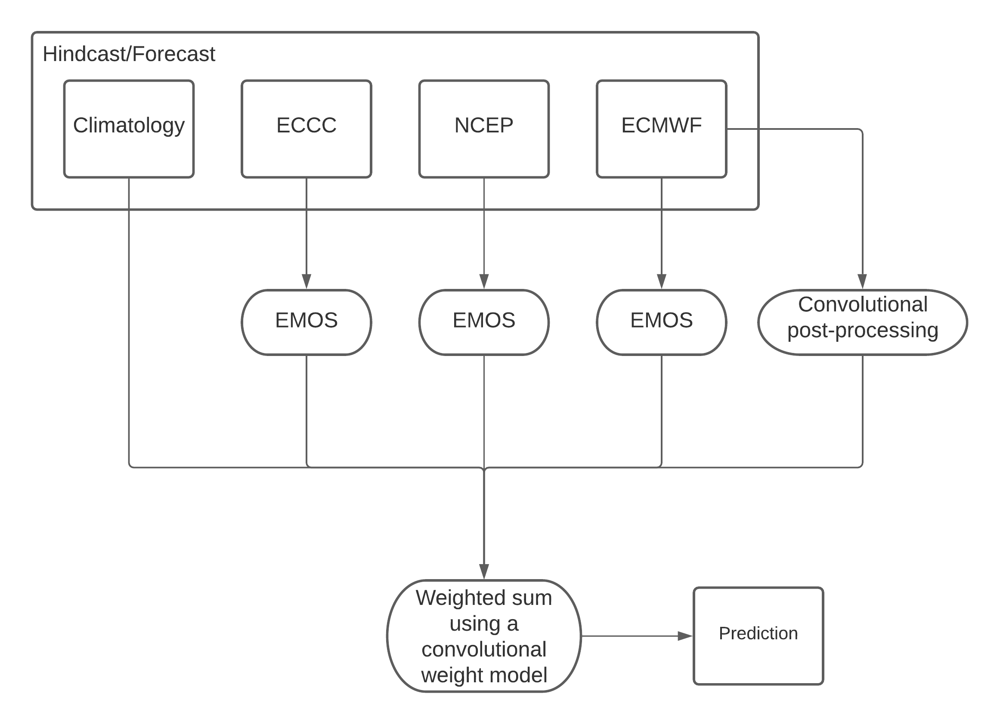

# CRIM S2S

Source code supporting the participation of the CRIM S2S team to the [WMO S2S Forecast
challenge](https://s2s-ai-challenge.github.io/).

## Model architecture

Our model is an opportunistic mixture model. It is a blend
of: 
- EMOS corrected forecasts from ECMWF, ECCC and NCEP
- CNN corrected forecast for ECMWF
- Climatology

A second CNN decides the relative weights. Then, a weighted
average of the 5 models is performed. The schematic below summarizes 
the model.



We call our model opportunistic because the weighting model has 
to detect where there is predictability and use the forecasts there.
It has to detect where the is no opportunity for predictability and 
use climatology in these circumstances.


## Reproducing

Here are the instructions to reproduce our results. The instructions
are unfortunately longer than we would have hoped. If any problem is
encountered during reproduction please feel free to reach out. We 
also have the possibility to provide intermediate datasets. For
instance if it is impossible to regenerate an ml-ready dataset using our
code, we could provide one.

### Package installation

This guide assumes that a conda installation is already available.

```bash
conda create -n s2s_repro -f environment.yml
conda activate s2s_repro
pip install -e <path_to_our_repo>
```

### Data preparation

#### Split the multi-level files into smaller chunks

The NetCDF files that contain multiple vertical levels were a little bit difficult 
to manipulate on our end. For this reason, our code assumes that there is a version
of these files that has been split into one netcdf by vertical level. We wrote
a small utility to do this. The splitting is only necessary for some fields from the
ECMWF model. The list of fields that should be split is configured in the 
`crims2s/splitter/conf/config.yaml`.

```
s2s_split_plev base_dir=<path_to_s2s_data> set=train
s2s_split_plev base_dir=<path_to_s2s_data> set=test
```

Here, `<path_to_s2s_data>` should contain the data pulled from climetlab, so
for instance `<path_to_s2s_data>/training-input` should exist and contain the 
necessary model files.

When this script is done, there should be new files named `ecmwf-hindcast-u200-20200102.nc` and so on.


#### Make an ML-Ready dataset


### Model training


#### Training EMOS models


#### Training the convolutional ensemble model


### Validation


## Getting Started

### Notebooks

The notebooks import the `crims2s` package in an absolute manner. That is, they grab
the package from the environment instead of relatively. That means you need to have
the `crims2s` package installed in your environment for the notebooks to work. To
install the package in development mode, go in the repository root and use
```
pip install -e .
```
If you do this from a conda environment, make sure that pip is installed in your
conda environment. Otherwise, this command could install the crims2s package in your
system instead of in your conda environment. To make sure that you use the right pip,
you can type
```
type pip
```
and validate that the path to pip leads to your conda environment.


### Datasets

The `mldataset` module is used to generate ml-ready datasets from the challenge data.
It also registers a console script through setuptools.
To generate examples from a single week in the year, use
``` 
s2s_mldataset output_dir=<output_directory> index=3
```
To generate a whole dataset using the default configuration, use
```
s2s_mldataset hydra/launcher=submitit_slurm output_dir=<output_directory> index="range(0,53)" -m
```
See `crims2s/conf/mldataset.yaml` for parameters of the generation.
See `crims2s/conf/hydra/launcher/submitit_slurm.yaml` to configure the Slurm jobs.

#### Test set

```
s2s_mldataset hydra/launcher=submitit_slurm set=test index="range(0,53)" output_dir=<output> -m
```

Test set on the CPU partition.
```
s2s_mldataset set=test fields=both_easy remove_realizations=True weekly_steps=True index="range(0,53)" output_dir=<output_dir> hydra/launcher=submitit_slurm +hydra.launcher.partition=cpu hydra.launcher.cpus_per_task=4 hydra.launcher.mem_gb=30 -m
```